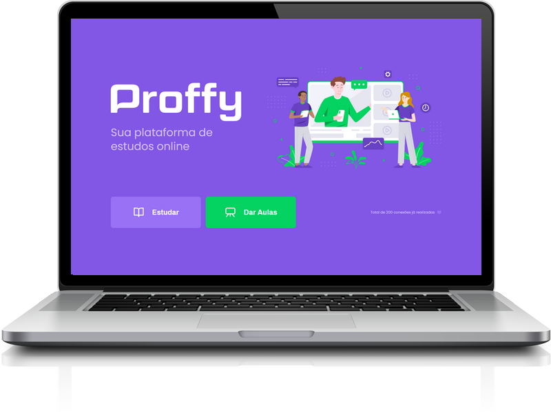

  

<h2> :page_with_curl: Sobre a aplicação </h2>

 Projeto desenvolvido durante os dias 3 a 9 de Agosto de 2020 com a trilha Discovery do evento Next Level Week 2 da Rocketseat e que teve como finalidade introduzir os conceitos de desenvolvimento web. Para isso, durante essa semana foi proposto o desenvolvimento da plataforma Proffy com o intuito de auxiliar na conexão entre os alunos e os professores. Esta aplicação oferece aos professores a possibilidade de registrar aulas, podendo adicionar informações como a disciplina, o custo e horário e aos alunos a possibilidade de buscar pelas aulas cadastradas. 

Este projeto foi idealizado pensando no 6 de agosto, onde se comemora o Dia Nacional dos Profissionais da Educação.

Instrutor: Mayk Brito 

<h2> :rocket: Tecnologias utilizadas </h2>

<h3>Front-end</h3>

HTML  
CSS  
JavaScript  
Nunjucks   

<h3>Back-end</h3>

Node.js  
SQLite  

<h2> :computer: Instalação </h2>

Para instalar os pacotes necessários é preciso ter o gerenciador de pacotes <a href="https://www.npmjs.com/" rel="nofollow">npm</a> (Node Package Manager), além do Node.js. Se você já possui, basta acessar a pasta raíz pelo terminal e rodar o comando abaixo para instalar as dependências:

<pre> npm i </pre>
 
Após instalar as dependências execute o comando abaixo para inciar o servidor local:
 
<pre> npm run dev </pre>
 
 O site poderá ser acessado por qualquer navegador utilizando a url: http://localhost:5500/ 
 
 
